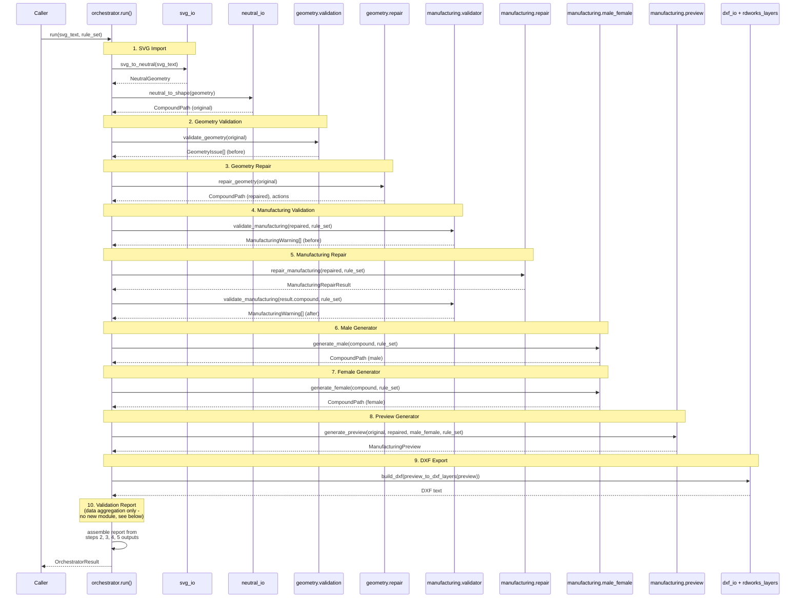

# Orchestrator Sequence Diagram

Shows `core.orchestration.orchestrator.run()` coordinating existing,
unmodified modules in the required order. The orchestrator itself
performs no geometry/manufacturing computation — every box below is an
existing function; the orchestrator only sequences the calls and
passes each step's output into the next.

## Notes

- **Steps 1–9** each call one existing, unmodified module. No new
  geometry, manufacturing, or file-format algorithm was written to
  build the orchestrator itself.
- **Step 10** ("Validation Report") has no dedicated module in the
  repository (confirmed missing by the prior repository audit). Rather
  than write a new report-generation algorithm, the orchestrator
  reshapes data already produced by steps 2–5
  (`GeometryIssue` list, `ManufacturingWarning` lists, repair actions,
  similarity score) into a plain JSON-serializable `dict`. This is data
  aggregation, not new validation logic.
- Manufacturing Validation (step 4) is deliberately run a second time
  after Manufacturing Repair (step 5), against the *repaired* geometry
  — this reuses the exact same `validate_manufacturing()` call both
  times, matching the "before/after" pattern already used by the
  existing `core.engines.manufacturing.pipeline.run_pipeline()`.
- Male (6) and Female (7) generation are called as two separate steps,
  matching the audit's finding that `generate_male()` and
  `generate_female()` already exist as independent functions — the
  orchestrator does not use the existing `generate_male_female()`
  convenience wrapper, so that the sequence diagram's step 6/step 7
  distinction is real in the code, not just in the diagram.
